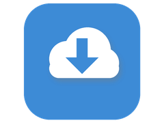
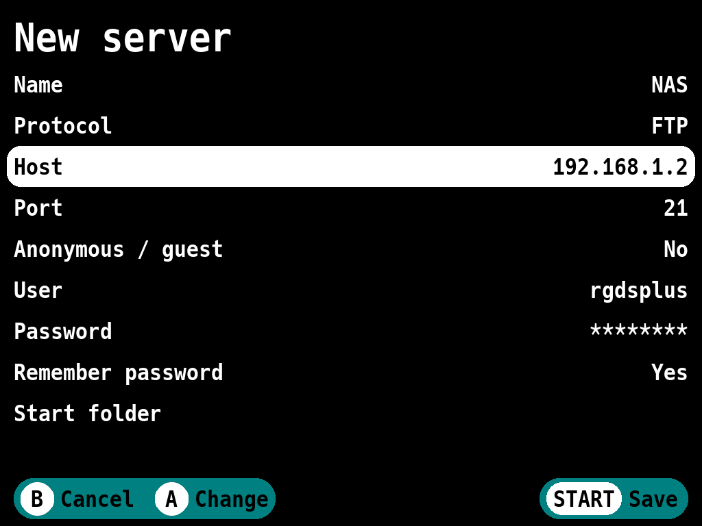
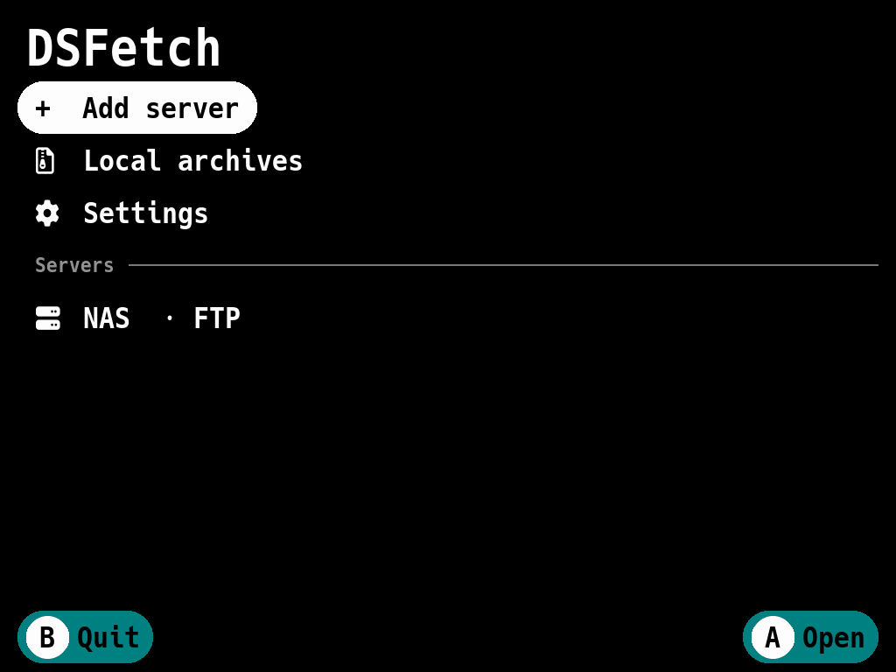
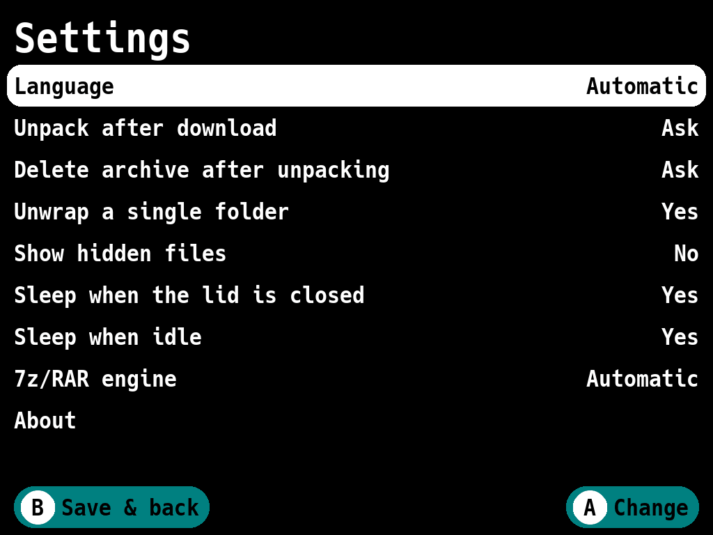

<p align="center"></p>

<h1 align="center">DSFetch</h1>

<p align="center">Download games to the Anbernic RG DS Plus straight from your NAS or PC</p>

## Features

- **FTP/FTPS, SFTP and SMB2/3** servers, saved with their logins.
- **Unpacks .zip, .7z and .rar** after the download, including multi-volume
  and password-protected 7z/RAR.
- **Picks the folder for you**: `Game.nds.7z` goes to `Roms/NDS` on the card
  with free space.
- **Resumes downloads** after a Wi-Fi drop, and checks free space and the
  FAT32 4 GB limit before starting.
- **Unpacks archives already on the cards** (*Local archives*).
- **Sleeps when you close the lid** or after the console's sleep timer, never
  in the middle of a download.
- **8 languages**; follows the console's language and screen settings.

## Getting started

### Install

DSFetch runs on the console's stock firmware.

1. Unzip the release archive into the root of a memory card (usually TF2,
   the games card).  
   On macOS use Terminal, since double-clicking the archive
   puts everything into an extra folder (`NO NAME` is the card's name):
   ```sh
   unzip -o ~/Downloads/DSFetch-rgdsplus-v1.0.0.zip -d "/Volumes/NO NAME"
   diskutil eject "/Volumes/NO NAME"
   ```
2. Turn on Wi-Fi in the console's settings.
3. Start **DSFetch** from *Applications* or *Ports*.

To update, unzip a newer release over the old one: servers and settings are
kept.  
If the *Applications* entry disappears (the Stock OS mod's updater clears `Roms/APPS` on TF1), unzip the release again.

To remove DSFetch, delete `Ports/DSFetch/`, `Ports/DSFetch.sh`,
`Ports/Imgs/DSFetch.png`, `Roms/APPS/DSFetch.sh` and
`Roms/APPS/Imgs/DSFetch.png` from that card (the first one holds the saved
servers and passwords).

### Add a server

1. On the main screen, choose **Add server**.
2. Set **Protocol**, **Host** (the IP address or name of your NAS or PC) and
   **User** and **Password**, or turn on **Anonymous / guest**.  
   The port follows the protocol.
3. Press **START** to save. The server appears under *Servers*; **Y** on it
   edits or deletes it.



### Download

1. Select the server and press **A**. SMB servers list their shares first.
2. **A** opens a folder, **B** goes back.
3. Press **A** on a file, or **X** to download the item under the cursor
   (a folder with everything inside).  
   For several items, press **Select**, mark them with **A** and press **X**.
4. Check **Card** and **Folder** (already suggested), and **Unpack archives**
   if shown, then press **START**.



New games appear in the console's menu after you quit DSFetch: **B** on the
main screen, or **Select + Start** on any screen. **Menu** shows help on
lists.

## Settings

Open **Settings** on the main screen; **B** saves and goes back.



| Setting | What it does |
|---|---|
| Language | *Automatic* follows the console, or pick a supported one |
| Unpack after download | Ask, always or never |
| Delete archive after unpacking | Ask, always or never |
| Unwrap a single folder | Unpacks an archive with one folder inside without that folder |
| Show hidden files | Shows files starting with a dot on servers |
| Sleep when the lid is closed | Sleeps 3 s after the lid closes, or when the download finishes |
| Sleep when idle | Sleeps after the console's sleep timer with no button pressed |
| 7z/RAR engine | *Automatic* uses the faster bundled `7zz`; *Built-in* is the fallback |

While DSFetch is open, the console's own sleep timer, lid and power button do
nothing; the two sleep settings above take over.  
Open the lid or press the power button to wake the console.

Saved passwords are encrypted with a key tied to the console: a card read on
a computer or in another console does not reveal them (DSFetch asks for them
again there). Someone with the console itself still can; turn off **Remember
password** in the server editor to type it every time.  
Plain FTP sends the password unencrypted, and DSFetch warns about it: prefer FTPS or SFTP.
Servers, settings and logs are in `Ports/DSFetch/data/`.

## Limitations

- FTP works in passive mode only; FTPS only as explicit TLS (usually port
  21), not implicit TLS on port 990.
- SFTP logs in with a password; SSH keys are not supported.
- SMB needs SMB2 or SMB3: servers that speak only SMB1 (old NAS) do not work.

## Reporting a problem

Open an issue at https://github.com/Misaka0x2730/dsfetch/issues with the
version from *Settings → About* and the `.log` files from
`Ports/DSFetch/data/`.  
For more detail, add `export DSFETCH_DEBUG=1` to `data/launcher.env` and repeat the problem first.  
The logs contain server addresses and file names, but no passwords.

## Development

DSFetch is written in Go on SDL2 (a fork of the
[gabagool](third_party/gabagool/FORK.md) UI library) and built for the
console in an arm64 Docker image.

### Layout

```
cmd/dsfetch            the app
cmd/sdlprobe           device probe: displays, controllers, raw input
cmd/devseed            adds the Docker test servers to ./devdata
internal/app           startup, screen router, input and sleep wiring
internal/ui            screens
internal/remote        Backend interface; ftp/, sftp/, smb/ clients
internal/transfer      resumable downloads (.part, retries, stall watchdog)
internal/archive       zip/7z/rar extraction, 7zz engine
internal/platform      cards, system folders, lid and sleep, device config
internal/store         servers (encrypted passwords) and settings
internal/i18n          UI translations
third_party/gabagool   the forked UI library
platforms/rgdsplus     launcher, Applications entry, icon
docker/, scripts/      arm64 build, device survey, test archives
```

The console's paths, buttons and hooks are in
`internal/platform/rgdsplus.json`; on a console, `data/platform.json` and
`data/launcher.env` override them without a rebuild.

### Build and run

On macOS (Apple Silicon):

```sh
brew install go go-task sdl2 sdl2_image sdl2_ttf sdl2_gfx sevenzip
task run                  # 1024x768 window; arrows, A/B/X/Y, Enter = Start,
                          # Space = Select, H = Menu
task test                 # unit tests
task dev:servers          # FTP, FTPS, SFTP and Samba in Docker
go run ./cmd/devseed      # add them to ./devdata for task run
task test:integration     # tests against those servers
task package              # dist/DSFetch-rgdsplus-<version>.zip (needs Docker)
task deploy CONSOLE=<ip>  # install on the console over SSH (user root)
task logs CONSOLE=<ip>
```

If cgo fails with `unknown architecture arm64e.x1` (Xcode older than the
Command Line Tools), set `DEVELOPER_DIR=/Library/Developer/CommandLineTools`; the Taskfile already does.  
Dev-mode helpers (autopilot screenshots, slowed downloads) are described in `internal/app/devtools.go`.

### Releases

Push a `v*` tag: CI (`.github/workflows/ci.yml`) tests, builds and publishes
a GitHub release with the zip and the source of its 7-Zip (LGPL); tags like
`v1.1.0-rc1` become pre-releases.
*Settings → About* shows the version from `git describe`.  
In a private repository without arm64 runners, set the variable
`PACKAGE_RUNNER=ubuntu-latest` (slower, under QEMU).

## License

MIT, see [LICENSE](LICENSE). Third-party components and their licenses
(including the LGPL-3.0 SMB library) are listed in
[THIRD_PARTY.md](THIRD_PARTY.md); the release zip carries their full texts.
